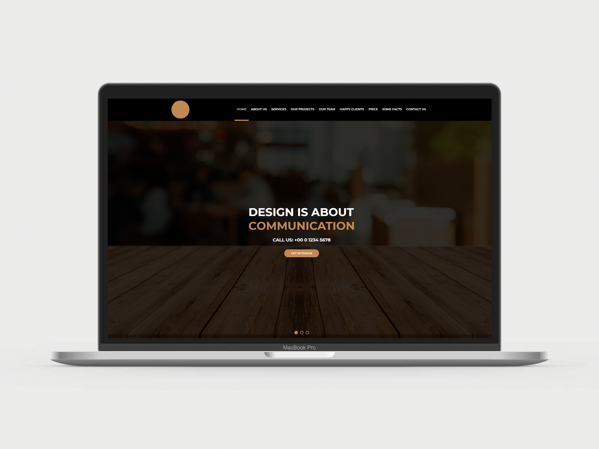

<h1 align="center">
    HTML5 studies with CSS3
</h1>

Study based on <a href="https://b7web.com.br/" target="_blank">B7Web</a> classes in order to learn HTML5 and CSS3. Website developed from Zero and compatible with WEB / Tablet / Mobile.

---

### :computer: Demo Web

   

### :iphone: Demo Mobile

---

   

## :rocket: Technologies

- HTML5
- CSS3 - Responsive Design

## :memo: License
This project is under the MIT license. See the [LICENSE](https://github.com/lukemorales/rocketshoes-react-native/blob/master/LICENSE) for more information.

---

Made with ♥ by Jonatas Pedroso :wave: [Get in touch!](https://www.linkedin.com/in/jonatas-pedroso-099953151/)
